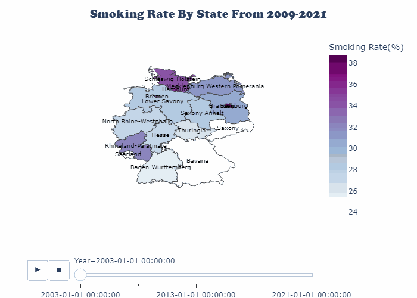

## Evaluating Obesity, Smoking and Myocardial Infarction Rates in Germany: A Retrospective Analysis for SDG 3 

#### **Introduction**

Key tenets of the [Sustainable Development Goals (SDGs)](https://www.un.org/sustainabledevelopment/health/) by 2030 include ensuring optimal health and preventing deaths from non-communicable diseases; cardiovascular diseases are the leading cause of these deaths. The global implementation of tobacco control is also a critical focus.

In this project, I will analyse the most recent data (2021) from the German Federal Statistical Office ([*Statistisches Bundesamt*](https://www.destatis.de/EN/)) to assess Germany's progress towards the aforementioned goals. Additionally, the project will also explore the influence of obesity and smoking on the prevalence of myocardial infarction across Germany's 16 federal states.

#### A closer look at the variables of interest

#### 1. OBESITY

Obesity, defined as a *BMI greater than 30*, is a risk factor for a myriad of potentially fatal diseases including:

* Cardiovascular diseases: Hypertension, coronary artery disease and stroke.
* Metabolic disorders: Type II Diabetes Mellitus and metabolic syndrome.
* Respiratory disorders: Obstructive sleep apnea and asthma.
* Reproductive disorders: Infertility, polycystic ovarian syndrome, preterm delivery and fetal macrosomia.
* Psychological disorders: Depression. 
* Cancer: Breast cancer, prostate cancer, ovarian cancer and many other cancers have been linked to obesity.

#### Is Germany having an obesity crisis?

As shown the line plot above, the overall trends in obesity rates reveal a significant increase over the past decades, posing a serious blow to Germany's progress towards SDG. 

As of 2021,

Top 3 States with the **Healthiest BMI (Lowest Obesity Rates)** were:

* Hamburg (12.6%)

* Berlin (13.8%)

* Baden-Wurttemberg (15.1%)

Bottom 3 States with the **Worst BMI (Highest Obesity Rates)** were:

* Mecklenburg Western Pomerania (21.2%)

* Thuringia (19.1%)

* Saxony Anhalt (18.9%)

While comparing the proportion of obese people in 2017 with recent data, **Saxony Anhalt**, **Thuringia** and **Saxony** saw the greatest declines in obesity rates nationwide, with percentage *decreases* of 9.2%, 6.4% and 5.3%, respectively. On the flip side, the obesity rates went up in **Saarland**, **Schleswig-Holstein** and **Lower Saxony** by 13.3%, 12.3% and 10.8%, respectively.

#### 2. SMOKING

Smoking, though commonly associated with the inhalation & exhalation of tobacco products, also encompasses non-tobacco products such as marijuana, e-cigarettes and other substances. However, tobacco consumption being a well-known risk factor for several diseases has remained the target for anti-smoking campaigns, some of which include:

* Cardiovascular diseases: Atherosclerosis, hypertension, coronary artery disease, peripheral vascular diseases, stroke.
* Metabolic disorders: Type II Diabetes Mellitus.
* Respiratory disorders: Chronic obstructive pulmonary disease, asthma, pneumonia.
* Reproductive disorders: Infertility, birth defects.
* Psychological disorders: Substance use disorder, schizophrenia, depression. There is a reciprocal causality whereby the use of tobacco can lead to psychiatric illnesses and vice versa. 
* Cancer: Lung cancer, mouth and throat cancers, bladder cancer, cervical cancer.

#### Achieving a Tobacco-Free Germany: Progress so far..

The figure above shows that there has been an impressive decline in smoking rates over the years across Germany. Despite the decline, proportion of smokers remained significant with the best state, Bavaria, having nearly one-fifth of its population as smokers.

Below are the rankings of the German states based on proportion of the population above 15 years of age who smoke at least occasionally, based on the 2021 survey:

Top 3 States with the **Lowest Proportion of Smokers**

* Bavaria (17.0%)

* Baden-Wurttemberg (17.4%)

* Saarland (18.5%)

Bottom 3 States with the **Highest Proportion of Smokers**

* Mecklenburg Western Pomerania (23.9%)

* Thuringia (23.4%)

* Bremen (22.7%)

#### Prevalence of Acute Myocardial Infarction in Germany

Acute Myocardial infarction (AMI), popularly referred to as *heart attack*, belongs to the group of ischemic heart diseases and occurs when there is insufficient supply of oxygen to the heart.

It is among the health metrics measured by EU countries under the **European Community Health Indicators** framework. The data used in this analysis was obtained from the [Federal Health Reporting (GBE)](https://www.gbe-bund.de/gbe/) survey conducted by the **Robert Koch Institute** and contains record of age-standardized heart attack rates (both first and recurrent attacks) from 2000-2022 by state.

While focusing on the trends in the attack rates from 2010 till 2022, a general decline in the incidence was observed.

In 2021, the worst-hit German states ranked in terms of case counts of myocardial infarction per 100,000 people were as follows:

* Saarland (405.2)
* Bremen (375.3)
* Mecklenburg Western Pomerania	(370.4)

#### THE BURNING QUESTION:
* *Were there any **statistically significant differences** in MI attack rates based on the proportion of smoking or obese individuals in 2021?*

On assessing the relationship between obesity, smoking and the prevalence of myocardial infarction using a Pearson correlation heat map, there seemed to be a strong linear relationship between being *obese* and *myocardial infarction* from the data. However, the relationship between *smoking* and *myocardial infarction* was fairly strong.

A simple linear regression analysis was done to measure the statistical significance in the relationship between smoking, obesity and myocardial infarction rate.

**Key Insights**

* Based on the results of the linear regression analysis and an alpha level of 0.05, it can be deduced that there was a significant association (p=0.0082) between the obesity rate and the prevalence of acute myocardial infarction in Germany in 2021.

* Although smoking is a known risk factor for cardiovascular disease, there was insufficient evidence (p=0.341) to establish a relationship between the smoking rate and the prevalence of myocardial infarction in 2021. This could be as a result of limitations in data collection methods (as reported by the German Federal Statistical Office (*Statistisches Bundesamt*) [here](https://www.destatis.de/EN/Themes/Society-Environment/Population/Households-Families/Methods/microcensus-2020.html#586042)). The inclusion criteria for smoking rate in the study were also broad, encompassing a wide range of participants from occasional to heavy smokers which could have weakened the expected association. 

* An analysis of the overall trends in obesity, smoking and myocardial infarction rates over the past decades revealed a decline in smoking and MI rates while obesity has been on the rise.

**My Recommendations**

Mecklenburg Western Pomerania, Bremen and Thuringia performed poorly across nearly all the metrics in 2021, highlighting the need for targeted interventions and policies in order to ensure alignment with the Sustainable Development Goals. Based on the results of the analysis, I propose the following recommendations to address key issues identified:

* Improved access to specialised healthcare centres to ensure early detection and prevention of heart diseases.
* Subsidies on healthy, heart-friendly foods.
* Promotion of healthy eating habits and physical activity. 
* Adequate support for those with psychological eating disorders.
* Health promotion campaigns to create increased awareness about the dangers of smoking.
* Higher taxation on tobacco products.
* More stringent rules on advertisements and sale of tobacco products.
* Affordable access to smoke cessation and weight loss programs.

---
**PACKAGES**

* Plotly v5.23.0

* Pandas v2.2.2

* Numpy v2.0.0

* Json v2.0.9

* Geopandas v1.0.1

* Pingouin v0.5.5

* Scipy v1.14.0

* PIL v10.4.0

* print_versions v0.1.0

**REFERENCES**

* Obesity - [Mesdcape](https://emedicine.medscape.com/article/123702-overview?form=fpf)
* Impact of Tobacco Smoking and Smoking Cessation on Cardiovascular Risk and Disease - [Mesdcape](https://www.medscape.com/viewarticle/577468_7)

**DATASET SOURCES**

[SDG Indicators - Germany](https://www.statistikportal.de/de/nachhaltigkeit/veroeffentlichungen)

[European Community Health Indicators - Acute Myocardial Infarction](https://www.gbe-bund.de/gbe/)

